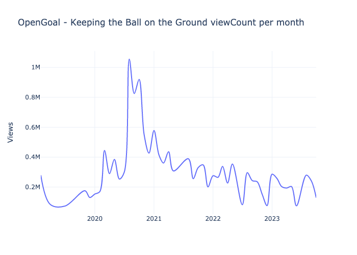
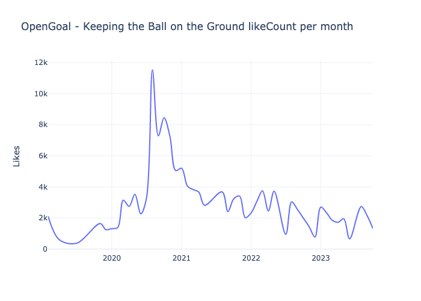
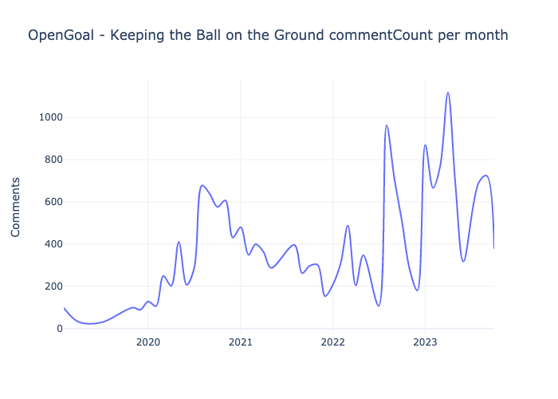
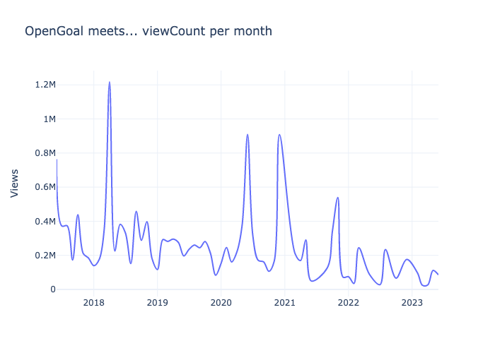
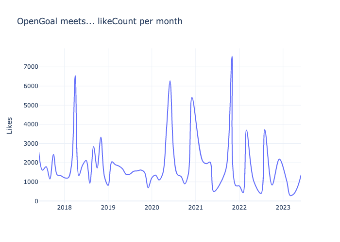
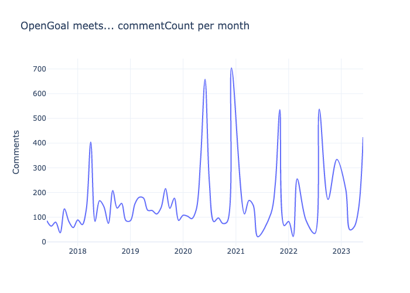

# OpenGoal
Quick analysis and visualisation of the monthly YouTube viewing figures for OpenGoal's 'Keeping the Ball on
the Ground' podcast.

## Project summary
This project involved:
- Connecting to YouTube's API to gather channel statistics
- Processing the JSON response
- Using Python to perform data cleaning and processing operations
- Data visualisation with plotly

**Language**: Python

**Packages**: pandas, numpy, plotly, regex

# Analysis
### Keeping the Ball on the Ground and OpenGoal meets monthly views

### Top 10 most viewed episodes (as of Nov 2023)
#### Keeping the Ball on the Ground
1. KIERAN TIERNEY | Keeping the Ball on the Ground (584371)
2. BARRY FERGUSON & SLANEY REUNITED! | Keeping the Ball on the Ground (345344)
3. AIDEN McGEADY | Keeping the Ball on the Ground (334937)
4. Keeping the Ball on the Ground | Charlie Mulgrew, Simon Ferry and Paul Slane (279470)
5. REVIEW OF CELTIC VS RANGERS w/ BARRY FERGUSON | Keeping the Ball on the Ground (259410)
6. Charlie Mulgrew is Back! | Keeping the Ball on the Ground (222783)
7. CHARLIE MULGREW RETURNS! | Keeping The Ball On The Ground (177784)
8. JOHN HIGGINS | Keeping the Ball on the Ground (177153)
9. RANGERS v CELTIC REVIEW w/ BARRY FERGUSON | Keeping the Ball on the Ground (175633)
10. SI & HALLIDAY HEATED DEBATE KICKS OFF! | Keeping the Ball on the Ground (174558)

#### OpenGoal Meets...
1. JAMIE CARRAGHER | Open Goal Meets... (855101)
2. Si Ferry Meets... Ally McCoist (752340)
3. Si Ferry Meets... Andy Halliday | Life at Rangers w/ Gerrard, Warburton & Pedro, Teammates & Stories (608241)
4. FUNNY ANGE POSTECOGLOU INTERVIEW | Open Goal Meets... Celtic (Now Spurs) Manager (308245)
5. Si Ferry Meets... Ian Durrant & Derek Ferguson - The Rangers Days (304129)
6. CHRIS SUTTON | Open Goal Meets... former Celtic, Blackburn & Chelsea Striker For Candid Interview (260215)
7. Si Ferry Meets... Andy Robertson - Rise to Liverpool & Scotland Captain via Queens Park, DUFC & Hull (234839)
8. Si Ferry Meets... Gordon Strachan (231435)
9. ANGE POSTECOGLOU IS BACK ON THE SHOW! | Open Goal Meets... Glen's Vodka February MOTM (193134)
10. Si Ferry Meets...Barry Ferguson Episode 1 - Rangers Education, Breaking into 1st Team, Captaincy (192150)

